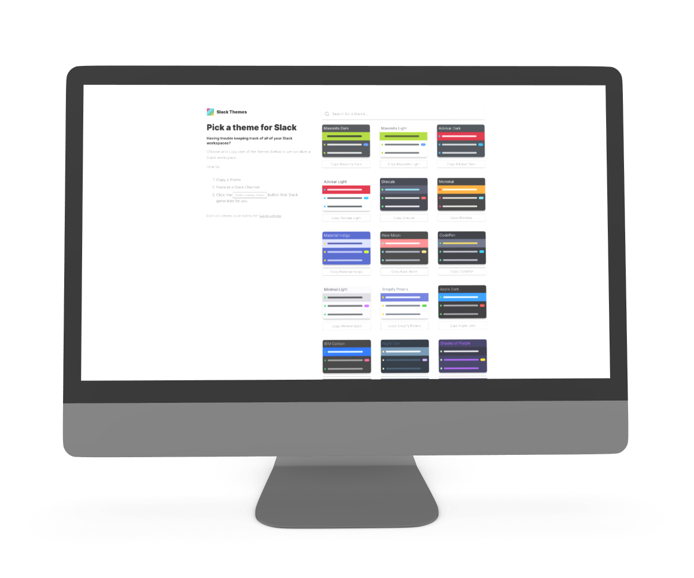

# Slack Themes (WIP)

Minimal & Modern React app documenting a collection of curated Slack Themes

Don't see a theme you're looking for? Open a pull request, an issue, or [Submit a Theme](https://forms.gle/ko6NiYzx6zEHiGb46)


---

## Usage
```bash
# Install dependencies

 $ yarn install
 
# Start webpack-dev-server at port 8080

 $ yarn run start
 
# Run linters

 $ yarn run test
 
# Build app for production (gets output in the 'dist' directory)

 $ yarn run build
```
